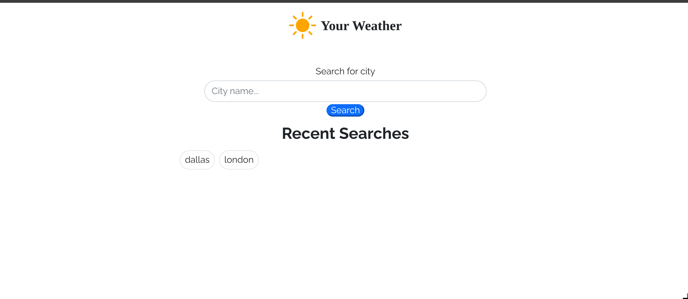
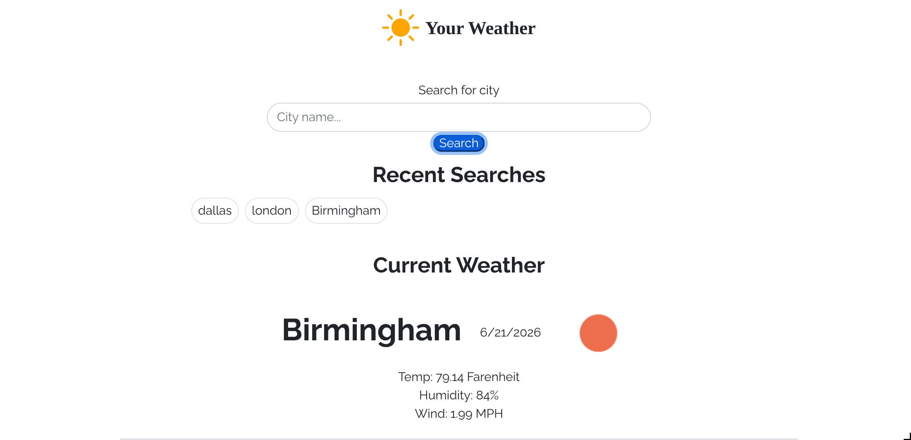
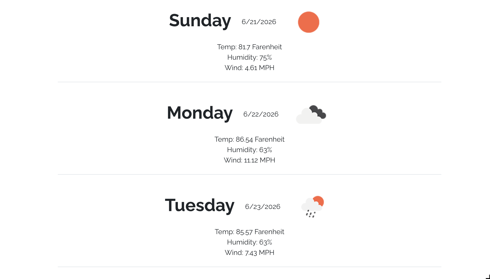

# Weather Checker

### Description

This is a simple weather app to check weather in your area. It only checks cities and states within the US at the moment. You type in a city and it gives current weather as well as the weather for the next 5 days. When you search for a city it also saves it to the recent searches box. When you click on one of them it brings up that weather again.

### User Story

- User searches for a city
- When user clicks submit that cities weather is displayed
    - It shows current weather and a 5 day forecast
- The search gets saved to the recent searches box
- When a city is clicked on from the recents box that weather is to be rendered to the page

### Screenshots

### Pages link
